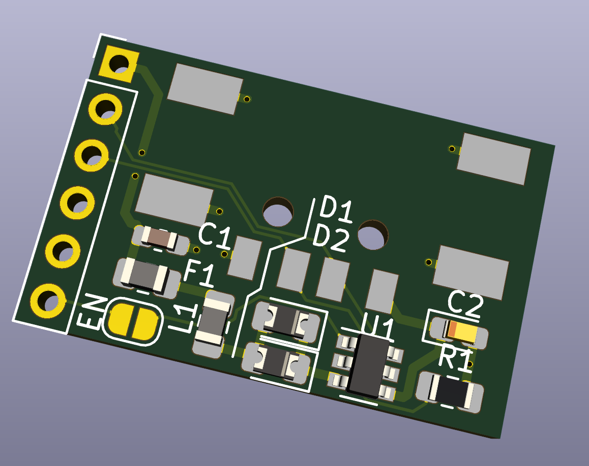
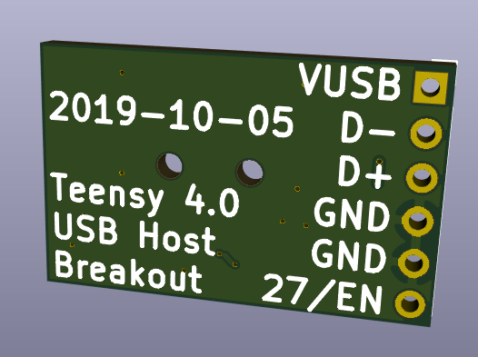

A companion breakout board with USB-A host connector to mate with the [Teensy 4 Header Breakout Board](https://github.com/blackketter/teensy4_header_breakout).  

It's designed to solder to the top 6 pins on the right side of the Teensy 4 Header Breakout.  

Designed in KiCad.

Notes:

- In progress: First prototype works great.
- With longer header pins you should be able to flip the board to be under or over the Teensy 4.0
- Download bom/ibom.html and view it with web browser to see bill of materials and placement information.
- The 6th pin provides an optional enable pin for the power management chip on digital pin 27.  For always-on, cut left trace and short right two pads.  

Pinout:

1. VUSB
2. USB Host D-
3. USB Host D+
4. GND
5. GND
6. 27/EN