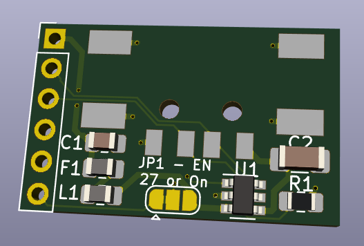

A companion breakout board with USB-A host connector to mate with the [Teensy 4 Header Breakout Board](https://github.com/blackketter/teensy4_header_breakout).  It's designed to solder to the top 6 pins on the right side of the header breakout.  The 6th pin provides an optional enable pin for the power management chip (short the solder bridge) on digital pin 27.

Designed in KiCad.

Notes:

- In progress: Will be ordered soon.
- With longer header pins you should be able to flip the board to be under or over the Teensy 4.0

Pinout:

1. VUSB
2. USB Host D-
3. USB Host D+
4. GND
5. GND
6. 27